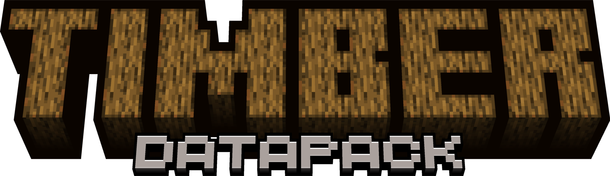
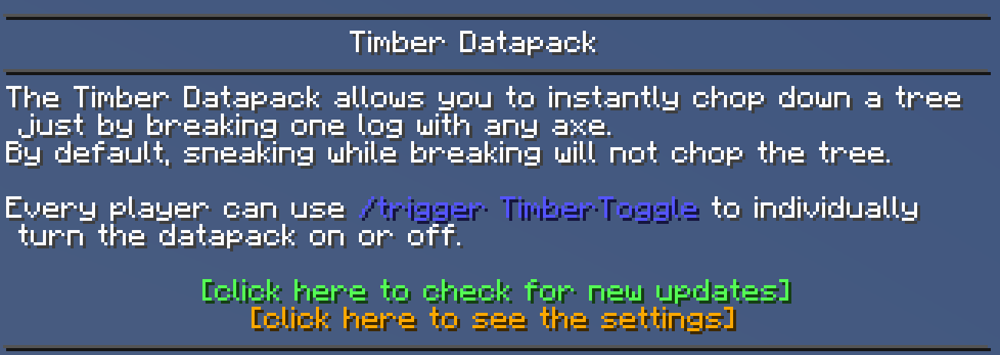
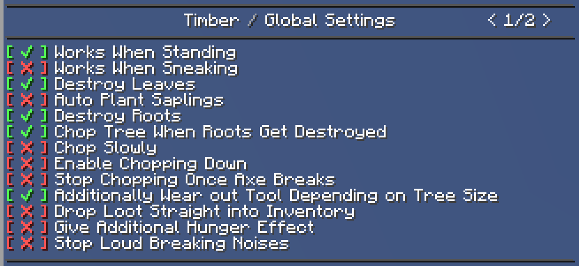
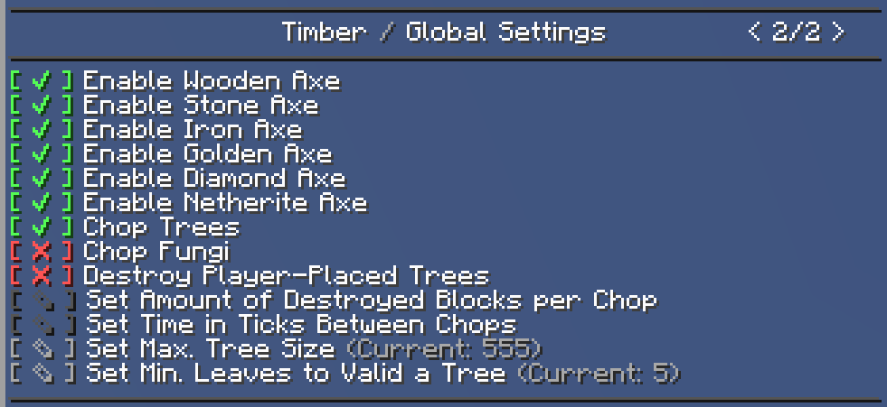

  

This is a really useful addition for those who don't want to spend expensive time on gathering resources! After installing, the Timber Datapack allows you to instantly chop down a tree just by breaking one log with any axe.  
By default, sneaking while breaking will not chop the tree.  
Optionally, you can adjust everything as you wish.  

# Under the Hood Features
- Chops only trees¹
- Works with every type of log²
- Supports custom trees³
- Leaves drop normal loot
- Takes account of any enchantment
- Many options for customization

¹ Trees are defined as logs that are next to naturally generated leaves.  
² Logs in the tag #minecraft:logs.  
³ All kind of custom trees like from **BiomesO'Plenty**, **The Biome Overhaul**, **Terrestria and Traverse**.  

# Preview


 
*Enable the option "Chop Fungi"

# Settings
To get descriptions and settings for this datapack use:

```/function timber:help```

If you don't have access to commands in your singleplayer world:  
1. Pause the game  
2. Click on Open to LAN  
3. In the options, change **Allow Cheats**: OFF to ON  
4. Click on Start LAN World  


Every player can individually turn the datapack ON or OFF by using:

```/trigger TimberToggle```

  
  
  

# Advanced Manual
Todo

# Installation instructions
- Download the Datapack
- Start Minecraft (Java Edition)
- Click on "Singleplayer"
- Select your world in which to install this Datapack (Don't click on play!)
- Click on "Edit"
- Click on "Open World Folder"
- Place the .zip file inside the **datapacks** folder (Don't unzip it!)
- Join/Rejoin the world or use /reload
- Finished! Enjoy!

Note: It does not work in creative mode!

# Server Compatibility
Other Minecraft servers, unlike Vanilla or Realm, often do not fully support Datapacks.  

Status | Server software | Notes
--- | --- | ---
✅ | Vanilla / Realm
✅ | Forge	|
✅ | Fabric |
🆗 | CraftBukkit | - Huge mushrooms don't always drop loot - Whole stack of saplings that got auto-planted get deleted rather than only one
🆗 | Spigot | - Huge mushrooms don't always drop loot - Whole stack of saplings that got auto-planted get deleted rather than only one
🆗 | Paper | - Huge mushrooms don't always drop loot - Whole stack of saplings that got auto-planted get deleted rather than only one

As of October 4th, 2020

# Credit
Inspired by Timber Mod and ChopTree Plugin, Map of the First Picture is from DarthEnigma and rendered with Chunky, Logo created with ewanhowell5195 Blockbench plugin  