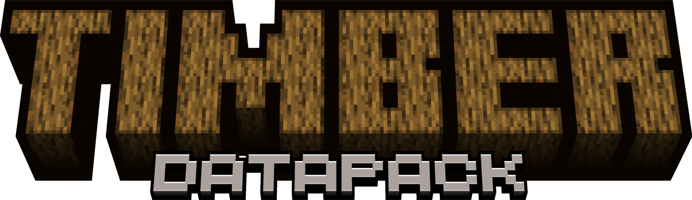
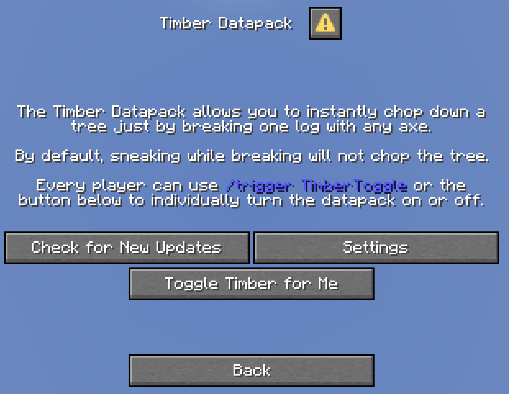
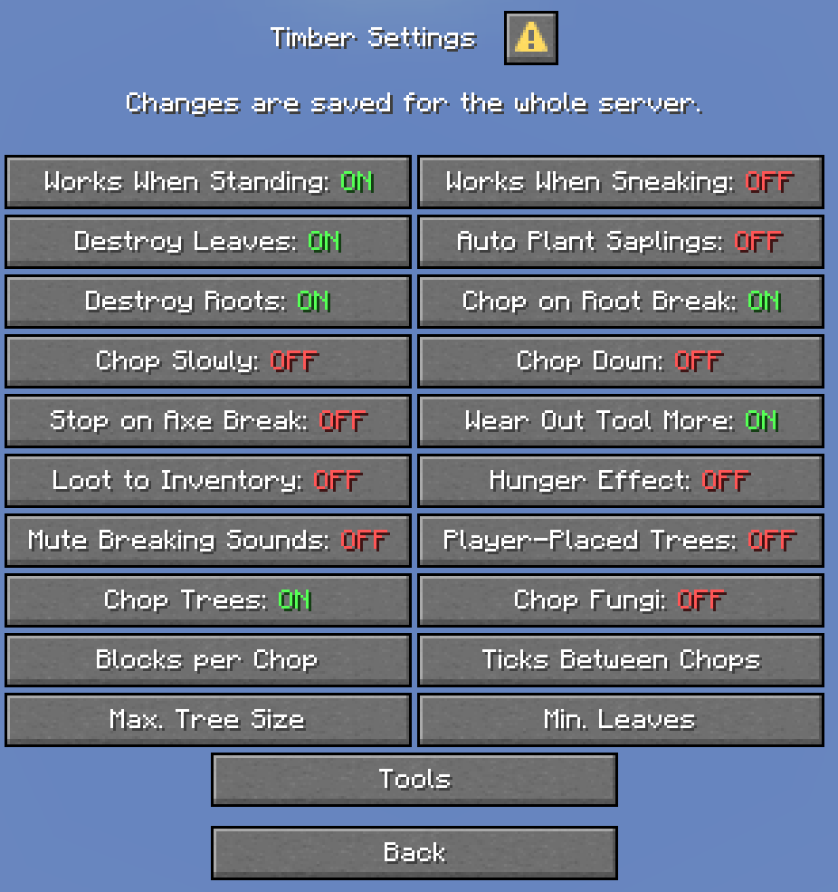
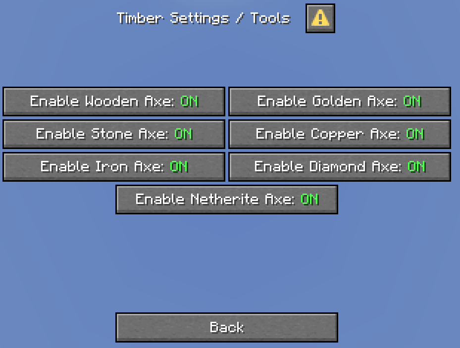

  

[](https://github.com/Moggla/Timber-Datapack/actions/workflows/test.yml) [](https://github.com/Moggla/Timber-Datapack/actions/workflows/latest.yml) [](https://github.com/Moggla/Timber-Datapack/actions/workflows/latest.yml)


This is a really useful addition for those who don't want to spend expensive time on gathering resources! After installing, the Timber Datapack allows you to instantly chop down a tree just by breaking one log with any axe.  
By default, sneaking while breaking will not chop the tree.  
Optionally, you can adjust everything as you wish.  

# Under the Hood Features
- Chops only trees¹
- Works with every type of log²
- Supports custom trees³
- Leaves drop normal loot
- Takes account of any enchantment
- Many options for customization

¹ Trees are defined as logs that are next to naturally generated leaves.  
² Logs in the tag #minecraft:logs.  
³ All kind of custom trees like from **BiomesO'Plenty**, **The Biome Overhaul**, **Terrestria and Traverse**.  

# Preview


 
> [!NOTE]
> Enable the option `Chop Fungi`

# Settings
To get descriptions and settings for this datapack use:

```
/function timber:help
```

<details>

<summary>If you don't have access to commands in your singleplayer world</summary>

1. Pause the game  
2. Click on `World Options...`
3. Toggle `LAN` to `ON`
4. Toggle `Command Access` to `ON`
5. Click on `Apply Changes`

</details><br>

Every player can individually turn the datapack ON or OFF by using:

```
/trigger TimberToggle
```

  
  
  

# Advanced Manual

## Add a Custom Axe
To add the axe of a mod (for example the emeraldaxe of supertools) run one command:

```
function timber:api/add_axe {item:"supertools:emeraldaxe", durability:500, label:"Emerald Axe"}
```
- `item` is the id of the axe, the one you get with `/give @s supertools:emeraldaxe`.
- `durability` is how much damage the axe can take. Timber takes the axe away when it reaches this value.
- `label` is the name of its button in the settings menu. The button appears by itself.

The command is forgotten at a `/reload`, so put it in a function that Timber runs on every load, see below.

## For Other Datapacks

<details>

<summary>Click to reveal</summary><br>

Timber has an API, so that your datapack can work together with it without changing any file of Timber (an update of Timber doesn't remove your changes). Everything below goes into a datapack of your own, with its own `pack.mcmeta`. Replace `mypack` with the namespace of your datapack.

### Register Axes When Timber Loads
Timber runs every function of the function tag `timber:register_axes` after it has registered its own axes, at every load and `/reload`.

`data/mypack/function/register_axes.mcfunction`
```
function timber:api/add_axe {item:"supertools:emeraldaxe", durability:500, label:"Emerald Axe"}
```

`data/timber/tags/function/register_axes.json`
```json
{
  "values": [
    "mypack:register_axes"
  ]
}
```

Also add the axe to the item tag `timber:axes`, it is used for the loot of mushroom stems:

`data/timber/tags/item/axes.json`
```json
{
  "values": [
    "supertools:emeraldaxe"
  ]
}
```

Good to know:
- Timber registers its vanilla axes with the same command (`data/timber/function/axes/init.mcfunction`). If you register one of them again, your values replace the vanilla ones.
- Timber only sees the damage of an axe. A modded axe with its own way of breaking may stay in the hand for a few more logs, that is not a problem.

### React to Broken Blocks
Timber runs these function tags for every block it chops, at the position of that block. Add your function to the tag to do something with it, for example to give xp or to play a sound.

| Function tag | Runs for |
|---|---|
| `timber:api/break_log` | a log |
| `timber:api/break_leaf` | leaves |
| `timber:api/break_root` | a root (mangrove) |
| `timber:api/break_stem` | the stem of a huge mushroom |
| `timber:api/break_cap` | the cap of a huge mushroom |

`data/timber/tags/function/api/break_log.json`
```json
{
  "values": [
    "mypack:on_log"
  ]
}
```

## Debugging
If something doesn't work, enable the output log (Minecraft Launcher → Settings → General → Enable `Open output log when Minecraft: Java Edition starts`). Timber writes a warning to the chat of everybody without the tag `noTimberWarning` when a call of the API is wrong.

</details><br>

# Installation Instructions
- Download the Datapack
- Start Minecraft (Java Edition)
- Click on `Singleplayer`
- Select your world in which to install this Datapack (Don't click on play!)
- Click on `Edit`
- Click on `Open World Folder`
- Place the `.zip` file inside the `datapacks` folder (Don't unzip it!)
- Join/Rejoin the world or use `/reload`
- Finished! Enjoy!

> [!NOTE]
> It does not work in creative mode!

# Server Compatibility
Other Minecraft servers, unlike Vanilla or Realm, often do not fully support Datapacks.  

Status | Server software | Notes
--- | --- | ---
✅ | Vanilla / Realm
✅ | Forge	|
✅ | Fabric |
🆗 | CraftBukkit | - Huge mushrooms don't always drop loot<br> - Whole stack of saplings that got auto-planted get deleted rather than only one
🆗 | Spigot | - Huge mushrooms don't always drop loot<br> - Whole stack of saplings that got auto-planted get deleted rather than only one
🆗 | Paper | - Huge mushrooms don't always drop loot<br> - Whole stack of saplings that got auto-planted get deleted rather than only one

As of October 4th, 2020

# Credit
Inspired by Timber Mod and ChopTree Plugin, Map of the First Picture is from DarthEnigma and rendered with Chunky, Logo created with ewanhowell5195 Blockbench plugin  